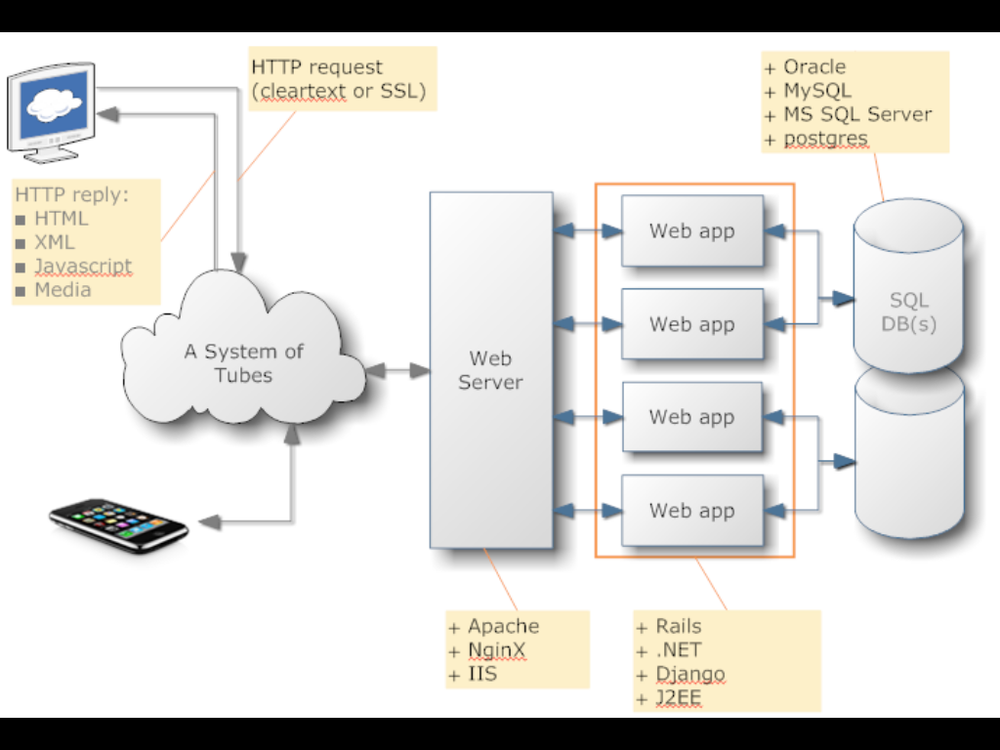
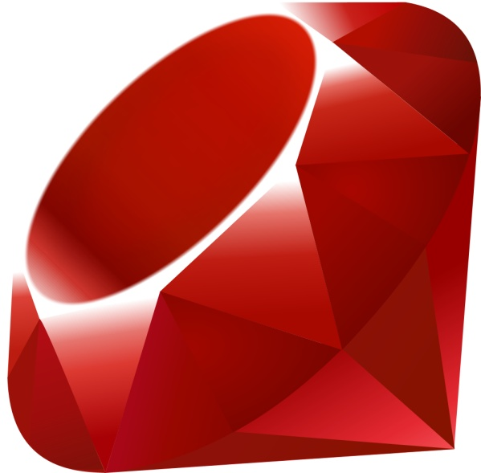
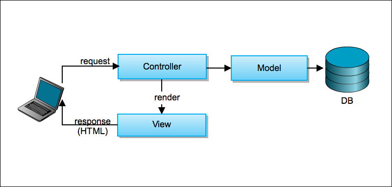
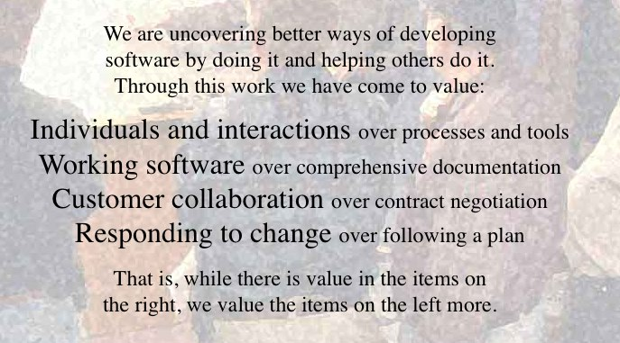

!SLIDE centereverything bullets
# Ruby on Rails Workshop

!SLIDE centereverything
# Welcome to an Open source workshop

<!SLIDE bullets>
* It's a community project!
  * Many individuals
  * RailsBridge
  * DevChix

<!SLIDE bullets>
* All materials are open!
  * DevChix wiki, RailsBridge wiki
  * Slides: github, slidedown
  * See github.com/railsbridge

<!SLIDE bullets>
# Why are we here?
* Ruby on Rails!

<!SLIDE bullets>
# What is Ruby on Rails?

!SLIDE center
# Web Application Plumbing

!SLIDE image 

!SLIDE center
# Ruby vs. Rails

!SLIDE center
Ruby is a Language

!SLIDE center
Rails is a Framework

<!SLIDE bullets>
# Ruby: 
* a programming language

<!SLIDE bullets>
# Ruby: 
* Object oriented

<!SLIDE bullets>
# Ruby: 
* General purpose

<!SLIDE bullets>
# Rails: 
* a web application framework

<!SLIDE bullets>
# Rails: 
* Database agnostic

<!SLIDE bullets>
# Rails: 
* Built using the Ruby Language

<!SLIDE bullets>
# Rails: 
* History
  * 37signals
  * 2004 - first released as open source
  * 2007 - shipped with Mac OS 10.5 "Leopard"

<!SLIDE bullets>
# The Rails Philosophy

<!SLIDE bullets>
* Opinionated
* Convention over configuration
* DRY (Don't Repeat Yourself)
  * less code means it's easier to maintain & modify

<!SLIDE bullets>
* Test Driven Development (TDD)
* Minimal code - maximal effect

<!SLIDE image>

!SLIDE center
# Agile development #

!SLIDE image

<!SLIDE bullets>
* Pair programming
* Test-driven or Behavior-driven development

<!SLIDE bullets>
# Goal:
### &nbsp;
### By the end of the day, you will have built and deployed a web application - live on the internet!

<!SLIDE bullets>
# Don't be shy!
* Ask questions!
* TAs and teachers are here too!

<!SLIDE bullets>
# Tools we'll be working with

<!SLIDE bullets>
* ** rack **: inluded with rails install

<!SLIDE bullets>
* **rails**: includes many ruby gems

<!SLIDE bullets>
* **rake**: like make for Ruby. An easy way to run tasks.

<!SLIDE bullets>
* **git**: source code control.

<!SLIDE bullets>
* **database**: we'll use SQLite, but could be any relational database.

<!SLIDE bullets>
* **editor**: KomodoEdit (?)

<!SLIDE bullets>
* **heroku**: free Rails hosting.

<!SLIDE bullets>
# Materials
* Slides: <https://github.com/railsbridge/docs/showoff_slides>
* Curriculum: <http://curriculum.railsbridge.org>

!SLIDE center
# Two Tracks Today

!SLIDE center
* Learn Ruby from the ground up
  * focus on learning to program

!SLIDE center
* Learn Rails (and Heroku and Github)
  * focus on tools and building web applications
