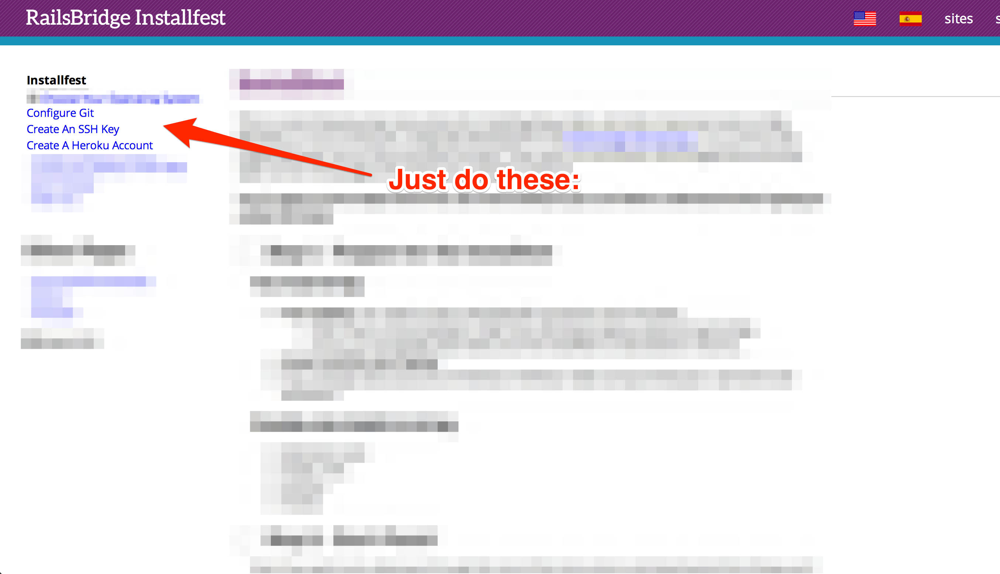

<!SLIDE centereverything bullets>

<!SLIDE bullets>
# Goal of the day
### &nbsp;
### Build and publish a web application
#### &nbsp; (In our case, a voting system)
### On the internetz!

<!SLIDE center>
# What will you learn today?

|Ruby|Rails|Git|Heroku|
|---|---|---|---|
|A programming Language|A Framework: patterns for building web apps|A source control system|An hosting platform|
|  |  |  |  |

<!SLIDE center>
# How do these fit together?

|Ruby, Rails|Git|Heroku|
|---|---|---|
|Code|Save|Publish|
|  |  |  |

<!SLIDE center>
# How does your set up work?

|Text Editor|Terminal|Browser|
|---|---|---|
|Write Code|Issue Commands|See the Results|
|  |  |  |

<!SLIDE bullets>
# How do we do this?
### Recap as you go
### Check the Glossary
### Don't be shy: ask questions
### Teachers are here to help
### Code of Conduct: [rbcpt.org/code](http://rbcpt.org/code/)
### Resources: [rbcpt.org/resources](http://rbcpt.org/resources/)

# Usually

### Friday night: InstallFest
### Saturday day: Intro to Rails

# [rbcpt.org/install](http://rbcpt.org/install/)

# [rbcpt.org/start](http://rbcpt.org/start/)