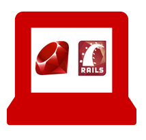
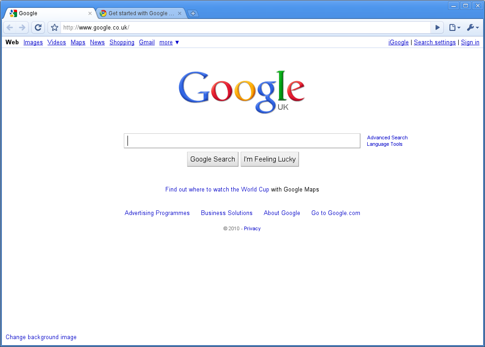

<!SLIDE centereverything bullets>

<!SLIDE center>
# Tonight

|Download|Install|Sign Up|Check|
|---|---|---|---|
|Lots of things|All those things|For Heroku|That they work|
|  |  |  |  |

<!SLIDE center>
# Tomorrow

|Ruby|Rails|Git|Heroku|
|---|---|---|---|
|A programming Language|A Framework: patterns for building web apps|A source control system|An hosting platform|
|  |  |  |  |

<!SLIDE center>
# Tonight

|Download|Install|Sign Up|Check|
|---|---|---|---|
|Lots of things|All those things|For Heroku|That **they** work|
|  |  |  |     |

<!SLIDE center>
# Ruby, Rails, Git, Heroku?

|Ruby, Rails|Git|Heroku|
|---|---|---|
|Code|Save|Publish|
|  |  |  |

<!SLIDE center>
# Your development set up

|Text Editor|Terminal|Browser|
|---|---|---|
|Write Code|Issue Commands|See the Results|
|  |  |  |

<!SLIDE bullets>
# And finally...

### Who are we?
### Type it out: don't Copy, Paste
### Help us improve the docs: stickies!
### Ask questions: Teachers are here to help
### Tweet using @RailsBridgeCPT, #RBCPT, or #railsbridge
### Code of Conduct: [rbcpt.org/code](http://rbcpt.org/code/)
### Schedule for tomorrow: [rbcpt.org/schedule](http://rbcpt.org/schedule/)

# [rbcpt.org/install](http://rbcpt.org/install/)

<!SLIDE bullets>
# Schedule for tomorrow

 * **09:00**-09:30: Breakfast
 * **09:30**-11:00: Opening presentation, **Workshop**
 * **11:00**-11:30: Break, Lightning Talk
 * **11:30**-13:00: **Workshop**
 * **13:00**-14:00: Lunch, Lightning Talk
 * **14:00**-15:00: **Workshop**
 * **15:00**-15:30: Break
 * **15:30**-18:00: **Workshop**, Survey