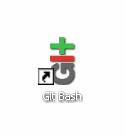
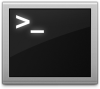

!SLIDE subsection
# Ruby Programming for Beginners

<!SLIDE bullets incremental>
# What we'll cover

* Programming: languages & applications
* What is Ruby?
* Ruby's common objects
* Ruby syntax basics
* Object oriented programming concepts
* Passing code to a Ruby interpreter

!SLIDE
# Programming

!SLIDE
# Operating System (OS)
Talk to a computer's `hardware`.

<table>
  <tr>
  <td>
  
  <td>
  
  <td>
  
  </tr>
</table>

!SLIDE
# Application
The `software`.  It sends `input` (`commands`, `data`, etc) to the operating system and receive `output` after the operating system has acted on it.


!SLIDE
# Language
A set of code that can be used to create an application.

* Ruby
* Python
* Perl
* Java
* C++

Many others.

Q: How is a computer language similar to a human language, like English or Spanish?  How is it different?

# Library
A collection of reusable code to accomplish a generic activity.

!SLIDE
# Framework
Collection of reusable code to facilitate development of a particular product or solution.

!SLIDE
## Ruby vs. Rails

### Ruby is a language


### Gems are Ruby libraries


### Rails is a framework 


!SLIDE
## Ruby vs. Rails
* Rails is written in Ruby language.
* Rails contains many Ruby gems.
* Rails is a framework.
* Rails' purpose is to build websites.

The rest of this tutorial isn't about Rails.
You're learning how to do _any_ kind of programming with Ruby.

<!SLIDE subsection incremental>
# Ruby Philosophy


```
I believe people want to express themselves when they program.
  
They don't want to fight with the language.

Programming languages must feel natural to programmers.

I tried to make people enjoy programming and concentrate on the fun and creative part of programming when they use Ruby.
```
 -- [Matz](http://linuxdevcenter.com/pub/a/linux/2001/11/29/ruby.html) (Yukihiro Matsumoto), Ruby creator


!SLIDE bullets
# Ruby is a scripting language

* Scripting languages:
  * Don't require a compiler.
  * Have an interpreter _(more on that later...)_
  * Run "on the fly"
  * Easy to change frequently

Python, Perl, and JavaScript are scripting languages too.

Java and C++ are examples of compiled languages.


!SLIDE centereverything


!SLIDE subsection

# Let's start coding!

!SLIDE bullets
# Open Your Terminal
You may also hear it called "command Line", "console", "shell", or "Bash"

* Windows: `git bash` 

* Mac OS X & Ubuntu: `Terminal` 


!SLIDE
# Prompt

* Terminals show a line of text when you login & after a command finishes
* It's called the `prompt`, and customarily ends with a dollar sign

Whenever instructions start with `"$ "`, type the rest of the line into terminal.

Let's give the terminal a `command`, to open Interactive Ruby (IRB)

```bash
  $ irb
```


!SLIDE commandline
# irb: Interactive Ruby

IRB has its own prompt, which customarily ends with `>`

```
  $ irb
  >
```

You can use `Control-C` to exit IRB any time.
Or type `exit` on its own line.

```ruby
  > exit
  $ 
```

Now you're back to the terminal's prompt.

    Windows Users! Some people have experienced trouble with backspace, delete, and arrow keys working properly in irb - what a pain! If you run into this problem, use this command instead to launch irb.

    $ irb --noreadline

!SLIDE

## Variables
### A variable holds information.
* We give it a name so we can refer to it
* The info it holds can be changed

```
  $ irb
  > my_variable = 5
  => 5
  > another_variable = "hi"
  => "hi"
  > my_variable = 10
  => 10
```

What is happening on the lines beginning with `=>` ?

* Setting a variable equal to something is called "assignment." In the above examples, we are assigning my_variable to 5 and my_other_variable to "hi."
* What types of information can we hold in a variable? (see next slide for answers)

!SLIDE
## Variable
### Variable Assignment

Variables are assigned using a single equals sign (`=`).

The *right* side of the equals sign is evaluated first, then the value is assigned to the variable named on the *left* side of the equals.

```ruby
  apples = 5
  bananas = 10 + 5
  fruits = 2 + apples + bananas
  bananas = fruits - apples
```

What happened on each line?  Is it what you expected?

<!-- TODO: Define & discuss return values -->

What could you do to see each's `return value` for confirmation?


!SLIDE !bullets
## Variable
### Variable Naming

Create a variable whose name has:

* all letters (like 'folders')

* all numbers like '2000'

* an underscore (like `first_name`)
  
* a dash (like 'last-name')
  
* a number anywhere (like `y2k`)

* a number at the start (like '101dalmatians')

* a number at the end  (like 'starwars2')

What did you learn?


!SLIDE bullets
# Common types of information
* Variables can hold many types of information, including:
	* String
	* Number
	* Collections
	* Booleans
	
* Don't know what these are? Don't worry! We're about to find out!

!SLIDE bullets
## String

A string is text. It must be wrapped in a matched pair of quotation marks.

```ruby
  $ irb
  > 'Single quotes work'
  => "Single quotes work"
  > "Double quotes work"
  => "Double quotes work"
  > "Start and end have to match'
  ">
```
  
What is happening on the last two lines?  How would you solve it?


### exercise
* Create variables called first_name, last_name, and favorite_color.
* Assign the variables to strings.
* Can you print out a sentence that reads "Hi, my name is (first name) (last name) and my favorite color is (favorite color)." with these variables? 
	* Hint: you can use a "+" to add strings together.


!SLIDE
## Numbers
* Numbers without decimal points are called **integers** and numbers with decimal points are called **floats**.
* Examples of integers:	
	* 0
	* -105
	* 898989898
	* 2
* Examples of floats:	
	* 0.0
	* -105.56
	* 0.33
	* 0.00004
* You can perform operations on both types of numbers with these characters: +, -, /, *
	
### exercises	
* Try dividing an integer by an integer. Try dividing an integer by a float. How are the results different? 
* Create two integer variables called num1 and num2 and assign them your favorite numbers.
* Next, compute the sum, difference, quotient, and product of these two numbers and assign these values to variables called sum, difference, quotient, and product, respectively.

!SLIDE
## Collection
### Collection types: Array, Hash

 * In the following slides, we will cover the following topics:
	* Definition of an Array
	* Array syntax
	* Array indexing
	* Array methods
	* Definition of a hash
	* Hash syntax
	* Hash indexing

!SLIDE
## Collection
### Array
An array is a list.

Each array must be surrounded by `square braces` aka `square brackets`. A comma separates each `member`.

    @@@ Ruby
    > fruits = ["kiwi", "strawberry", "plum"]
    => ["kiwi", "strawberry", "plum"]

### exercises	
* Make your own array and name it grocery_list. 
* Include at least 5 items from your grocery list in the array.

!SLIDE
## Collection
### Array
#### Indexing

Members are stored in order. Each can be accessed by its `index`. Ruby starts counting at _zero_.

    @@@ Ruby
    > fruits[0]
    => "kiwi"
    > fruits[1]
    => "strawberry"
    > fruits[2]
    => "plum"

### exercises	
* Still have your grocery_list array? Good, because we're going to use it in this exercise.
* What is at index zero in your grocery_list array? How about index 5? Guess the answers and then use the syntax in the examples above (eg: fruits[0]) to see if your guesses were right. 

!SLIDE
## Collection
### Hash
In a `hash` we can refer to a member by a keyword instead of a number. Each member is a pair:

* *Key*: address of the hash member

* *Value*: variable contained by the member, and located by key name

A hash may also be known as a `dictionary`, `associative array`, or `map`.


!SLIDE
## Collection
### Hash
#### Hash Syntax

A hash is surrounded by `curly braces` aka `curly brackets`. A comma separates each member pair. A key uses `=>` (the `rocket`) to point to its value.

    @@@ Ruby
    > states = {"CA" => "California",
    "DE" => "Delaware"}
    => {"CA"=>"California", "DE"=>"Delaware"}

In real life, what lists do we make in key/value pairs?


### exercises	
* Define a Hash variable called my_info which has the following keys:
	* "first_name"
	* "last_name"
	* "hometown"
	* "favorite_food"

!SLIDE
## Collection 
### Hash
#### Hash Indexing

Member pairs can be accessed by their key.  So each hash key has to be unique.

Values don't have to be unique.

    @@@ Ruby
    > states["CA"]
    => "California"

### exercises	
* Add the key "good_food" to your my_info hash and give it the same value as your favorite_food key. What happens?
* Add a second "favorite_food" key to your my_info hash. What happens when you print out the has hash again? Why?


!SLIDE
## Methods

### things that do stuff.

* "If objects (like strings, integers, and floats) are the nouns in the Ruby language, then methods are like the verbs." - Chris Pine's "Learn to Program"
* Methods are called (used) with a "."  
 	* Example: 5.to_s (to_s is the method)
* As it turns out, 5 + 5 is really just a shortcut way of writing 5.+ 5.
* Each data type (string, integer, float) has a set of built in methods. You can see all of the string methods here: http://ruby-doc.org/core-1.9.3/String.html (there are tons - don't worry about memorizing them, just good to know where you can go to find out more)

### exercises
* Create a String variable called old_string and assign it the value "Ruby is cool"
* Use String methods to modify the old_string variable so that it is now "LOOC SI YBUR" and assign this to another variable called new_string.
 * Hint: look at the string methods "upcase" and "reverse"

!SLIDE
## Boolean

A boolean is one of only two possible values: `true` or `false`.

```
  > 1 + 1 == 2
  => true
  > 1 + 1 == 0
  => false
```

( `==` means "is equal to". _More on that later._)

### exercises	
* Create a variable named favorite_color and assign it to your favorite color.
* Create a variable named not_favorite_color and assign it to a different color.
* Test to see if these variables are equal.

!SLIDE
## Operators

### Do stuff with objects

```
  > my_variable + 2
  => 7
  > my_variable * 3
  => 15
```
```
  > my_fruits = fruits + ["lychee"]
  => ["kiwi", "strawberry", "plum", "lychee"]
  > my_fruits = my_fruits - ["plum"]
  => ["kiwi", "strawberry", "lychee"]
```

### exercises	

* Create an array called "vegetables" than contains 3 vegetables you like and 1 vegetable you don't like.
* Using the vegetables array, create an array called "my_vegetables" that contains only the vegetables you like.
* Extra: can you use the first two arrays to create a third array called "your_vegetables" that only contains the vegetable you don't like?

!SLIDE
## Loop
### Does something repeatedly

```
  > fruits.each do |fruit|
  ?> puts fruit
  > end
  kiwi
  strawberry
  plum
  => ["kiwi", "strawberry", "plum"]
```
On the second line, what does `?>` indicate?

### exercises
* Create an array of 4 places you would like to visit.
* Print out each of these places using a loop.
	* Example: 

```
"I would like to visit Barcelona"
"I would like to visit Antigua"
"I would like to visit Alaska"
"I would like to visit New Orleans"
```

!SLIDE
## Conditional

### Do something only if a condition is true

```
  > fruits.each do |fruit|
  ?> puts fruit if fruit == "plum"
  > end
  plum
  => ["kiwi", "strawberry", "plum"]
```

### exercises 
* Create an array called "group" that contains the names of some of the people in your Railsbridge group. Make sure you include your own name.
* Using your group array, create a conditional that prints "My Name is (your name)" for your name only.

!SLIDE
# Running Your Code

!SLIDE subsection
# Interpreter

Ruby is an interpreted language. Its code can't run by the computer directly.  It first must go through a Ruby interpreter.

The most common interpreter is Matz's Ruby Interpreter ("MRI").  There are many others.

There are various ways to run code through a Ruby interpreter. We were using IRB earlier and now we will use a file.

!SLIDE
## Running code from a file
### Create the file

* Why use a file? What's different from, say, irb?

Note which folder your terminal is currently in, this is your `working directory`

In your text editor, create a file named `my_program.rb` inside your working directory.

    @@@ Ruby
    class Sample
      def hello
        puts "Hello World!"
      end
    end

    s = Sample.new
    s.hello

!SLIDE commandline
## Passing code from a file
### Run the saved code

```
  $ ruby my_program.rb
  Hello World!
```


!SLIDE commandline
## Passing code from a file
### We can even load that file's code into IRB!

```bash
  $ irb
  > load 'my_program.rb'
  > second_time=Sample.new
  > second_time.hello
```

When might it be useful to do this?
 

!SLIDE subsection
# Your Own Command Line Program

!SLIDE bullets
# Hello World


`hello.rb`

    @@@ Ruby
    puts "Hello, World!"

!SLIDE bullets
# Arguments (ARGV)

`hello.rb`

    @@@ Ruby
    puts "Hello, #{ARGV.first}!"

`terminal`

```
$ ruby hello.rb Alice
Hello, Alice!
```

!SLIDE bullets
# Conditionals

`hello.rb`

    @@@ Ruby
    if ARGV.empty?
    puts "Hello, World!"
    else
    puts "Hello, #{ARGV.first}!"
    end

`terminal`

    $ ruby hello.rb
    Hello, World!
    $ ruby hello.rb Alice
    Hello, Alice!

!SLIDE
# Object Oriented Programming (OOP)

!SLIDE subsection
## Ruby is very object oriented
### Nearly everything in Ruby is an object.


!SLIDE
## Class
Describes the generic characteristics of a single _type_ of object.

What things of this type _are_.

e.g. Dog, Vehicle, Baby


!SLIDE
## Method
Defines _behavioral_ characteristic.

What the things of the class's type _do_.

e.g. Chase, Drive, Talk


!SLIDE
## Variable
Defines _attribute_ characteristic.

What things of the class's type _have_.

e.g. Breed, Model Year, Favorite Ice Cream


!SLIDE
## Instance
A specific incarnation of the class.

e.g. Rin Tin Tin, garbage truck, the neighbor's kid


!SLIDE
# Let's Create Projects!

!SLIDE
## Project 1:
### [Personal Chef Lab](http://tutorials.jumpstartlab.com/projects/ruby_in_100_minutes.html)
_(start at "4. Objects, Attributes, and Methods")_

Topics:

* Commandline program. Practice in Ruby syntax and OOP concepts, and creating commandline programs.

* Explore strings: concatenation, manipulation, interpolation, coersion.

* Symbols, nil, basic math operators, blocks, method chaining, passing parameters to methods, iteration, branching, conditionals & conditional looping.

!SLIDE
## Project 2:
### [Encryptor Lab](http://tutorials.jumpstartlab.com/projects/encryptor.html)

Topics:

* Commandline program.  Reinforce skills learned in Personal Chef.

* Explore how to manipulate arrays, do more elaborate strings manipulations, refactor code, take advantage of character mapping, and  access the filesystem from within code.


!SLIDE
## Project 3:
### [Event Manager Lab](http://tutorials.jumpstartlab.com/projects/eventmanager.html)

Topics:

* Commandline program. Reusing others code & data, refactoring your own code & cleaning up data, writing custom code to solve requirements.

* Gems, `initialize` method, parameters, file input/output, processing/sanitizing data, looping, conditional branching, using file-based data storage (CSV, XML, JSON), accessing an external API, nils, DRY principle, constants, sort_by, more string manipulations.


!SLIDE
## Project 4:
### Testing & More

A follow-up to EventManager focusing more on Ruby object decomposition and working with Command Line Interfaces and program control flow.

4. [Testing](http://tutorials.jumpstartlab.com/topics/internal_testing/rspec_and_bdd.html) Topics: TDD, BDD, Rspec
_(stop at "Exceptions")_
4. [Event Reporter Lab](http://tutorials.jumpstartlab.com/projects/event_reporter.html) Topics: Object decomposition, working with Command Line Interfaces, and program control flow. Continues project created in Event Manager lab.

6. [Rspec](http://tutorials.jumpstartlab.com/topics/internal_testing/rspec_practices.html )
