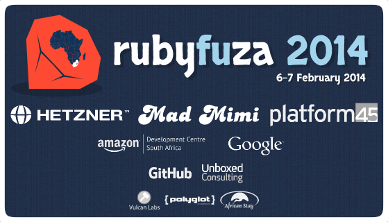

<!SLIDE centereverything bullets>

<!SLIDE bullets incremental>
# You have completed RailsBridge
### Congratulations!

<!SLIDE bullets>
# Please thank our awesome sponsors!

### goodies

<!SLIDE bullets>
# What did we learn?
### Ruby as a language
### Rails as a framework
### MVC design pattern

## Resources

http://rbcpt.org/resources

<!SLIDE bullets>
# And now...
### Retrospective with Cara
### Food!