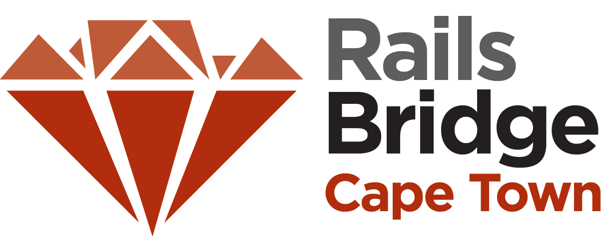

<!SLIDE centereverything bullets>

<!SLIDE bullets incremental>
# You have completed RailsBridge
### Congratulations!

<!SLIDE bullets>
# Please thank our awesome sponsors!

### ebook goodies

<!SLIDE bullets>
# What did we learn?
### Ruby as a language
### Rails as a framework
### MVC design pattern

## Resources

http://docs.railsbridgecapetown.org/workshop/resources

<!SLIDE bullets>
# Celebrate!
### After-party
### Peddlars on the Bend
[Directions: http://goo.gl/maps/P79pr](http://goo.gl/maps/P79pr)

<!SLIDE bullets>
# Right now
### Take this survey: https://www.surveymonkey.com/s/railsbridge_ct_july_exit
### Five e-books up for grabs!
