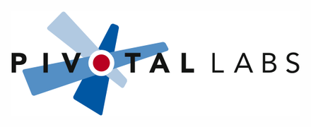
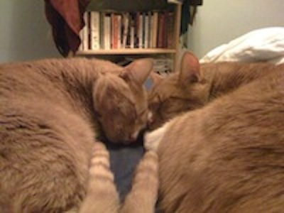

<!SLIDE bullets incremental>
# Welcome to RailsBridge #32
* OMG

<!SLIDE bullets>
# Thank you to our lovely sponsor

<!SLIDE bullets>
# And thank you to Lillie Chilen!

<!SLIDE bullets>
# Schedule
* 9:00-9:30 Sign in, get coffee
* 9:30-10:00 Intro
* 10:00-10:50 Session 1
* 11:00-12:00 Session 2
* 12:00-1:00 Lunch
* 1:00-2:15 Session 3
* 2:30-3:30 Session 4
* 3:30-4:00 Wrap up & final questions
* 4:00 Grab a drink (or 2 or 3?) at Thirsty Bear: 661 Howard

<!SLIDE bullets>
## Subject: "Ruby Class" 9/10/2010

"I am here now and things are going OK. I definitely have no idea what anyone is saying but hopefully I will someday." 

<!SLIDE bullets>
## Subject: "An incredibly exciting thing just happened" 2/4/2011

"At the 'install fest' - I encountered a problem and actually fixed it myself! WoW" 

