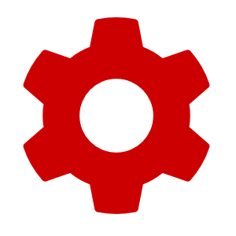
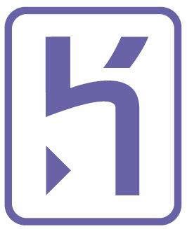

<!SLIDE centereverything bullets>

<!SLIDE center>
# Tonight

|Download|Install|Sign Up|Check|
|---|---|---|---|
|  |  |  |  |

<!SLIDE center>
# Tomorrow

|Ruby|Rails|Git|Heroku|
|---|---|---|---|
|  |  |  |  |

<!SLIDE center>
# Tonight

|Download|Install|Sign Up|Check|
|---|---|---|---|
|  |  |  |     |