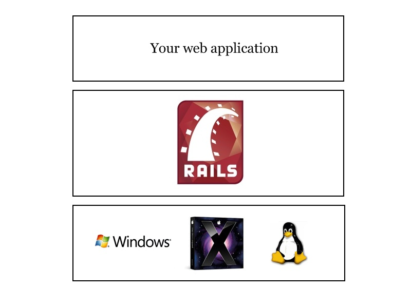
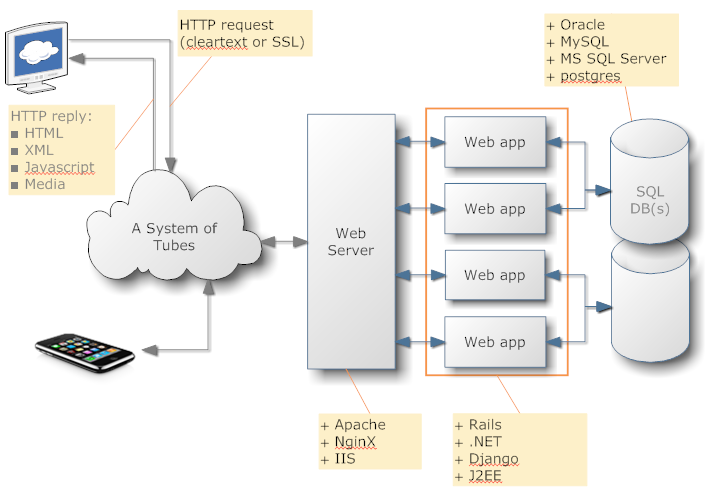

!SLIDE subsection

# The Complete Beginner's Guide to Programming

!SLIDE

# What is a program?

!SLIDE
# Operating Systems

<table>
  <tr>
    <td>
      
    <td>
      
    <td>
      
  </tr>
</table>

!SLIDE
# Applications

!SLIDE centereverything

# Web Application In Rails

!SLIDE incremental smbullets
# How do I write one?

* Learn about customer's requirements
* Translate to "stories"
* Pick a story that seems doable
* Write code that does it
* Show your work to the customer, get feedback
* Based on feedback, adjust your stories
* When a story is done, go back to "pick a story"
* Repeat until app is finished!

!SLIDE subsection

# Let's start writing code!

!SLIDE bullets
# "The Terminal"

* Windows: git bash 

* Mac OS X: Terminal 

* aka "The Shell" or "The Command Line" or "The Console" or "Bash" or "Shell"

!SLIDE commandline
# irb: the Interactive Ruby Browser

    $ irb

    Windows Users! Some people have experienced trouble with backspace, delete, and arrow keys working properly in irb - what a pain! If you run into this problem, use this command instead to launch irb.

    $ irb --noreadline

!SLIDE

## Variables
### words that hold information

    > my_variable = 5
    => 5
    > my_other_variable = "hi"
    => "hi"

!SLIDE
## Many types of information

* Strings
* Numbers
* Collections
* Dates
* Booleans (true/false)
* etc.

!SLIDE
## Strings (text)

!SLIDE
## Numbers

!SLIDE
## Collections

* Arrays
* Hashes

!SLIDE
## Arrays

An Array is a list of objects.

    >> fruits = ["kiwi", "strawberry", "plum"]
    => ["kiwi", "strawberry", "plum"]

!SLIDE
# Array Indexing

Ruby starts counting at zero.

    >> fruits[0]
    => "kiwi"
    >> fruits[2]
    => "plum"
    >> fruits[3]
    => nil

!SLIDE
# Array methods

* first, last
* push, pop
* shift, unshift

        fruits.first #=> "kiwi"

!SLIDE
# Hashes

* aka Dictionary or Map
* collection of key/value pairs

        >> states = {"CA" => "California",
            "DE" => "Delaware"}
        => {"CA"=>"California", "DE"=>"Delaware"}

        >> states["CA"]
        => "California"

!SLIDE
## Operators

### doing stuff with variables

    > my_variable + 2
    => 7
    > my_variable * 3
    => 15
    > my_fruits = my_fruits + ["lychee"]
    => ["kiwi", "strawberry", "plum", "lychee"]
    > my_fruits = my_fruits - ["lychee"]
    => ["kiwi", "strawberry", "plum"]

!SLIDE
# Loops

### doing the same thing a bunch of times

The hard way:

    >> puts fruits[0]
    kiwi
    => nil
    >> puts fruits[1]
    strawberry
    => nil
    >> puts fruits[2]
    plum
    => nil

!SLIDE
# Loops

### doing the same thing a bunch of times

The easy way:

    >> fruits.each {|f| puts f}
    kiwi
    strawberry
    plum
    => ["kiwi", "strawberry", "plum"]

!SLIDE
# Loops (multi-line)

The easy way, with "do...end" rather than "{...}"

    >> fruits.each do |f|
    ?> puts f
    >> end
    kiwi
    strawberry
    plum
    => ["kiwi", "strawberry", "plum"]

!SLIDE
## Conditionals

### doing something only if a condition is met

    >> fruits.each do |f|
    ?> puts f if f == "plum"
    >> end
    plum
    => ["kiwi", "strawberry", "plum"]

!SLIDE subsection
# Command-Line Programs

!SLIDE bullets
# Hello World

hello.rb:

    @@@ Ruby
    puts "Hello, World!"

!SLIDE bullets
# Arguments (ARGV)

hello.rb:

    @@@ Ruby
    puts "Hello, #{ARGV.first}!"

terminal:

    $ ruby hello.rb Alice
    Hello, Alice!

!SLIDE bullets
# Conditionals

hello.rb:

    @@@ Ruby
    if ARGV.empty?
      puts "Hello, World!"
    else
      puts "Hello, #{ARGV.first}!"
    end

terminal:

    $ ruby hello.rb
    Hello, World!
    $ ruby hello.rb Alice
    Hello, Alice!

!SLIDE
# Sinatra

hello_app.rb:

    @@@ Ruby
    require 'rubygems'
    require 'sinatra'

    get '/' do
      "<b>Hello, <i>bang bang</i>!"
    end

!SLIDE commandline
# Sinatra

    $ gem install sinatra
    $ ruby hello_app.rb
    == Sinatra/1.2.6 has taken the stage on 4567 for development with backup from Thin
    >> Thin web server (v1.2.7 codename No Hup)
    >> Maximum connections set to 1024
    >> Listening on 0.0.0.0:4567, CTRL+C to stop

then open a browser to <http://localhost:4567/>

!SLIDE bullets
# sinatra with rerun

    gem install rerun
    rerun hello_app.rb

...now it'll automatically reload when you edit a file.

!SLIDE
## Web App Network Architecture

!SLIDE
## Web App MVC Architecture

