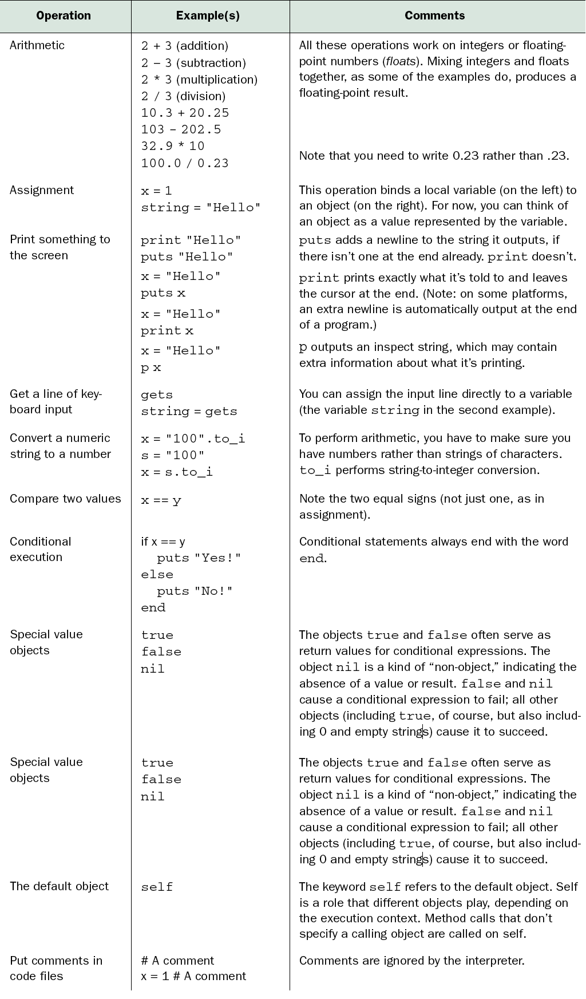

!SLIDE subsection
# Introduction to Ruby for Programmers

This section is intended as a brief, lightweight overview of the Ruby language; following sections will cover all these topics in much more detail. Students are encouraged to ask questions, but instructors are encouraged to answer, "We'll cover that later."

(Originally based upon [Ruby Quickstart for Refugees](https://gist.github.com/190567) but improved by many.)

!SLIDE

# Ruby vs. Rails

### Ruby is a Language

### Rails is a Framework

### Rails is written in Ruby

<!SLIDE subsection incremental>
# Ruby Philosophy

Q: Did you have a guiding philosophy when designing Ruby?

A: Yes, it's called the "principle of least surprise."

I believe people want to express themselves when they program.

They don't want to fight with the language.

Programming languages must feel natural to programmers.

I tried to make people enjoy programming and concentrate on the fun and creative part of programming when they use Ruby.

&nbsp;&nbsp;- [Matz](http://linuxdevcenter.com/pub/a/linux/2001/11/29/ruby.html) (Yukihiro Matsumoto), Ruby creator

!SLIDE incremental
# Ruby Philosophy, Applied

* Ruby has a *humane interface*
  * many ways to do things
* Ruby favors readability and variety over concision and perfection
* sometimes makes code hard to understand (but usually makes it easier)
* contrast to *minimal interface*
  * one (or a few) "right" ways to do things
  * Python has a minimal philosophy

# Many Rubies

* Ruby 1.0 released in 1996
  * Fully Open Source
* Many implementations
  * MRI
    * REE
    * Kiji
  * JRuby
  * Rubinius
  * MagLev
  * MacRuby
  * IronRuby

# Versions common today

* MRI 1.8.7
* MRI 1.9.2
* JRuby

# Ruby Language Overview

* Dynamically typed
* Interpreted
* Can be modified at runtime
* Object oriented
* Blocks / lambdas / closures
* Perl-like regular expressions
* Closely tied to shell & OS

# IRB: Interactive RuBy

    @@@ ruby
    $ irb
    >> 4
    => 4
    >> 4+4
    => 8

Please fire up `irb` on your computer and try this out!

# Everything evaluates to something

    @@@ ruby
    >> 2 + 2
    => 4

    >> (2+2).zero?
    => false

    >> "foo" if false
    => nil

    >> puts "foo"
    foo
    => nil

# Hash mark comments, like perl

    @@@ ruby
    # is a comment
    2 + 2 # is a comment

# Optional semicolons, parens, and `return`

These are equivalent:

    @@@ ruby
    def inc x
      x + 1
    end

    def inc(x)
      return x + 1;
    end

    def inc(x); x + 1; end

# Line Break Gotcha

    @@@ ruby
    x = 1 + 2
    x #=> 3

    x = 1
      + 2
    x #=> 1

Solution: always put operators on top line

    x = 1 +
        2
    x #=> 3

# Use parens when you need them

    @@@ ruby
    >> "Hello".gsub 'H', 'h'
    => "hello"

    >> "Hello".gsub("H", "h").reverse
    => "olleh"

!SLIDE
# Variables are declared implicitly

    @@@ ruby
    first_name = "Santa"
    last_name = "Claus"
    full_name = first_name + last_name
    #=> "SantaClaus"

# String interpolation

    @@@ ruby
    "boyz #{1 + 1} men"
    => "boyz 2 men"

* Any Ruby code can go inside the braces
* It gets evaluated and stuck inside the string

!SLIDE custom
# Built-in Types

* Numbers
  * `42`
* Booleans
  * `true`
  * `false`
* Strings
  * `"apple"`
  * `'banana'`
* Symbols
  * `:apple`
* Arrays
  * `["apple", "banana"]`
* Hashes
  * `{:apple => 'red', :banana => 'yellow'}`
* Ranges
  * `(1..10)`

# Functions

    @@@ ruby
    def add(a,b)
      a + b
    end

    add(2, 2)
    #=> 4

* Note: no 'return' required

# Classes and methods

    @@@ ruby
    class Calculator
      def add(a,b)
        a + b
      end
    end

* a *function* inside a *class* is called a *method*

# bang and question methods

* method names can end with `!` or `?`
  * `!` means "watch out!"
  * `?` means "boolean"

# equal, double-equal, and threequal

* `x = 1` means "put the value `1` in the variable `x`"
* `x == 2` means "`true` if `x` is `2`, otherwise `false`"
* `x === 3` means the same as `==` but sometimes more

# Ruby syntax cheatsheet

(_The Well-Grounded Rubyist_, p. 5, section 1.1.2)

# Ruby identifiers

* `local_variable` - start with letter or underscore, contain letters, numbers, underscored
* `@instance_variable` - start with `@`
* `@@class_variable` - start with `@@`
* `$global_variable` - start with `$`
* `Constant` - start with uppercase letter
* `method_name?` - same as local, but can end with `?` or `!` or `=`
* keywords - about 40 reserved words (`def`) and weirdos (`__FILE__`)
* literals - `"hi"` for strings, `[1,2]` for arrays, `{:a=>1, :b=2}` for hashes

# Ruby Naming Conventions

methods and variables are in `snake_case`

classes and modules are in `CamelCase`

constants are in `ALL_CAPS`

> Standard is better than better.
>
> -- Anon.

# Variable Scopes

    @@@ ruby
    var   # local variable (or method call)
    @var  # instance variable
    @@var # class variable
    $var  # global variable
    VAR   # constant

# Messages and Methods

* an object is referenced by a variable or a literal
* the dot operator (`.`) sends a message to an object
* an object receives a *message* and invokes a *method*
* with no dot, the default object (`self`) is the receiver

# Classes

* A class defines a group of behaviors (methods)
* Every object has a class, `Object` if nothing else

# `load` and `require`

* `load` inserts a file's contents into the current file
* `require` makes a *feature* available to the current file
  * skips already-loaded files
  * omits the trailing `.rb`
  * can also be used for extensions written in C (`.so`, `.dll`, etc.)

# Credits

* "Ruby Intro" slides based on [Ruby Quickstart for Refugees](https://gist.github.com/190567) by [Jacob Rothstein](http://about.me/jbr)
* Improved by Alex Chaffee, Sarah Allen, Wolfram Arnold

