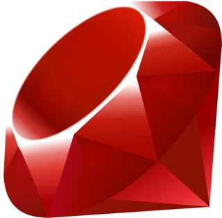

!SLIDE centereverything bullets

# Ruby on Rails Workshop

<!SLIDE bullets>

# Open source workshop

* It's a community project!
  * Many individuals
  * RailsBridge
  * DevChix

* All materials are open!
  * RailsBridge wiki
  * Slides: github, deck
  * See <http://github.com/railsbridge>

* Spin-off Workshops
  * RailsGirls, PyStar, Python Ladies, Scala
  * Learn the Front End, Confident Coding JS, and...?

<!SLIDE bullets>
# Why are we here?
We want the community of software developers to reflect the diversity of our society

<!SLIDE bullets>
# Why are we here?
* Ruby on Rails!

<!SLIDE bullets>
# What is Ruby on Rails?

!SLIDE center
# Ruby vs. Rails

|Ruby is a Language | Rails is a Framework |
|----|-----|
|  |  |

<!SLIDE bullets>
# Ruby: programming language

* Object oriented
* General purpose

<!SLIDE bullets>
# Rails: web application framework

* Database agnostic
* Built using the Ruby Language
* History
  * 37signals
  * 2004 - first released as open source
  * 2007 - shipped with Mac OS 10.5 "Leopard"

<!SLIDE bullets>
# The Rails Philosophy

* Opinionated
* Convention over configuration
* DRY (Don't Repeat Yourself)
  * less code means it's easier to maintain & modify
* Test Driven Development (TDD)
* Minimal code - maximal effect

<!SLIDE bullets>
# Agile development

* Pair programming
* Test-driven or Behavior-driven development

<!SLIDE bullets>
# Goal:
### &nbsp;
### By the end of the day, you will have built and deployed a web application - live on the internet!

<!SLIDE bullets>
# Don't be shy!
* Ask questions!
* TAs and teachers are here to help

<!SLIDE bullets>
# Tools we'll be working with
* **rails**
* **rake**: like make for Ruby. An easy way to run tasks.
* **git**: source code control.
* **database**: we'll use SQLite, but could be any relational database.
* **editor**: Sublime Text 2
* **heroku**: free Rails hosting.

<!SLIDE bullets>
# Materials
* Slides: <http://curriculum.railsbridge.org/workshop>
* Suggestotron Curriculum: <http://curriculum.railsbridge.org/>

<!SLIDE bullets>
# What will you learn today?
* Ruby
  * understanding the Ruby programming language
* Rails
  * learn tools and patterns for building web apps in Ruby on Rails
