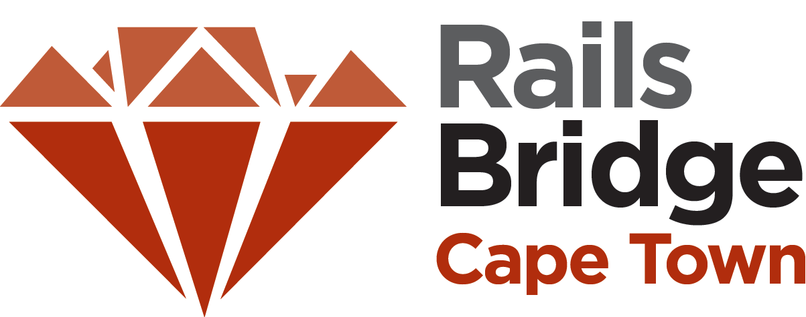

<!SLIDE centereverything bullets>

<!SLIDE bullets>
# Schedule for the day

 * **09:30**-10:00: Opening presentation
 * **10:00**-12:30: Workshop
 * **12:30**-13:30: Lunch
 * **13:30**-15:00: Workshop
 * **15:00**-15:30: Break
 * **15:30**-17:00: Workshop
 * **17:00**-17:30: Closing presentation, **Survey**, eBook giveaway
 * **17:30**-18:00: Retrospective

<!SLIDE bullets>
# Open source workshop

### Community project
### Documentation and slides can be edited by anyone

<!SLIDE bullets>
# Why are we here?

### Diversity in Cape Town tech
### Programming skills: useful, empowering, fun
#### &nbsp; (Especially on the web)
### Bring more people to the Ruby community
### Encourage thinking about diversity and outreach
### Provide people new to programming access to experienced programmers

<!SLIDE bullets>
# Goal of the day
### &nbsp;
### Build and publish a web application
#### &nbsp; (In our case, a voting system)
### On the internetz!

<!SLIDE center>
# What will you learn today?

|Ruby|Rails|
|---|---|
|A programming Language|A Framework: patterns for building web apps|
|  |  |

<!SLIDE bullets>
# The Rails Philosophy

### Opinionated
### Convention over configuration
### Minimal code - maximal effect

<!SLIDE bullets>
# Last but not least
### Don't be shy: ask questions
### Teachers are here to help
### Tweet using @RailsBridgeCPT, #RBCPT, or #railsbridge
### Code of Conduct: <http://railsbridgecapetown.org/code-of-conduct.html>
