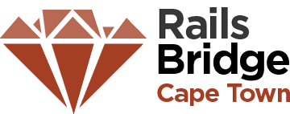

<!SLIDE centereverything bullets>
#
&nbsp;

<!SLIDE bullets>
# Schedule for the day

 * **09:30**-10:00: Opening presentation
 * **10:00**-12:30: Workshop
 * **12:30**-13:30: Lunch
 * **13:30**-15:00: Workshop
 * **15:00**-15:30: Break
 * **15:30**-17:30: Workshop
 * **17:30**-18:00: Closing presentation
 * **18:00**-later: Afterparty

<!SLIDE bullets>
# Open source workshop

* It's a community project
* All materials are open
  * RailsBridge documentation and slides
  * See <http://github.com/railsbridge> and <http://github.com/RailsBridge-CapeTown>

<!SLIDE bullets>
# Why are we here?
  * Improve diversity in Cape Town tech circles.
  * Show how programming skills can be useful, empowering, and fun.
    * Particularly when applied to the web.
  * Bring more people into the local Ruby community.
  * Encourage more user groups to think about diversity and outreach.
  * Provide people new to programming access to experienced programmers.

<!SLIDE bullets>
# Goal
### &nbsp;
### By the end of the day, you will have built and deployed a web application - live on the internet!

<!SLIDE bullets>
# What will you learn today?

### Ruby
Understanding the Ruby programming language

### Rails
Learn tools and patterns for building web apps in Ruby on Rails

<!SLIDE center>
# Ruby vs. Rails

|Ruby is a Language | Rails is a Framework |
|----|-----|
|  |  |

<!SLIDE bullets>
# The Rails Philosophy

* Opinionated
* Convention over configuration
* Minimal code - maximal effect

<!SLIDE bullets>
# Materials
* Slides: <http://docs.railsbridgecapetown.org/workshop>
* Suggestotron Curriculum: <http://docs.railsbridgecapetown.org/curriculum>

<!SLIDE bullets>
# Don't be shy
* Ask questions
* Teachers are here to help